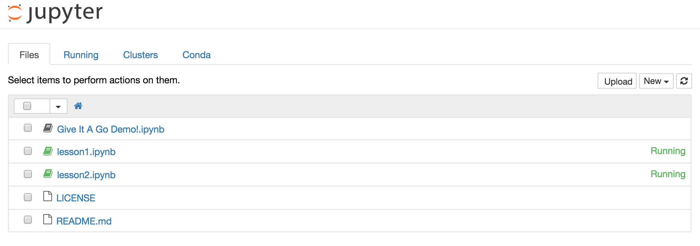

##### LSESU Applicable Maths Society
# Learn Programming in Python

###### Taught by Tom Sherborne, Pavlos Charalambides, Josiah Lee

This is an an introductory course to programming using the Python language. This course will teach you the basics of programming with Python, an easy to learn language popular with beginners. The course will cover basics (data structures, logic, variables) first and then move onto how Python can be used for financial analysis like option pricing and simple chart generation. For a general idea about this course, check out our introductory [Give It a Go! talk](https://docs.google.com/presentation/u/1/d/1FHhpGavkM2se9Wfj_FkO1n-plpa4-wDqUkBz-9Ui_MQ).

This course is for beginners and no prior knowledge of Python is assumed, if you know another language like R or Java already then the basics will seem familiar. Instructions and support will be provided for Mac OS X, Linux and Windows users. Using an iPad or Android Tablet is not recommended. 

### Course Structure
1. Getting setup, variables, loops and logic
2. Objects and functions, using libraries
3. Strings, indexing, iterating, reading files, comprehensions
4. Useful Data structures (tuples, dicts and sets), More advanced comprehensions
5. Creating classes of objects. Magic methods. OOP Structure in Python.
6. Data manipulation with Numpy and Pandas
7. Data visualisation with Matplotlib
8. Wrapup class, request a topic you want to learn about!

### Setup Instructions (Mac)
#### Installing

For this class we will be using the [Anaconda version](https://www.continuum.io/downloads) of Python and [Jupyter Notebook](http://jupyter.readthedocs.io/en/latest/install.html). Install __Python 3.5__ and Jupyter by following the instructions [here](https://www.continuum.io/downloads), select the 64 bit installation option.

Apple computers come with a version of Python installed already, but this is the old Python 2.7 and installing **Python 3.5** allows you to use the most up to date features of the language.

After installing Python, you can test if the installation was successful by opening Terminal and typing this command and hitting Enter.
```
python3 --version
```
Now you should see something like:
```
Python 3.5.2 :: Continuum Analytics, Inc.
```
Which tells you that Python is installed. If you don't see this, then try restarting your computer and trying again.
When this is completed successfully, run each of these commands one by one in Terminal. 
```
python3 -m pip install ipykernel
python3 -m ipykernel install --user
```

#### Opening the lessons
Create a folder on your Desktop called `learn-python` to keep all of the lesson files in. You can download all lessons from the [LSESU Application Maths Website](http://www.lsesumaths.com/presentations.html). You are free to keep the downloaded files in a different place, but you will have to run different commands than below. The following commands assume your lessons are all in the folder `Desktop/learn-python`.

Each lesson is a Jupyter Notebok `.ipynb` file, this is an interactive environment to test and run Python code line by line, To open the lesson file, open Terminal and run the following commands:

```
cd ~/Desktop/learn-python
jupyter notebook
```
The Jupyter application will now activate and your default browser will now open with a screen which looks like this:



You can now click on the lesson you want to open and start writing Python. To close the Jupyter Notebook application return from your browser to Terminal and type Ctrl+C.

### Setup Instructions (Windows)
#### Installing

For this class we will be using the [Anaconda version](https://www.continuum.io/downloads) of Python and [Jupyter Notebook](http://jupyter.readthedocs.io/en/latest/install.html). Install __Python 3.5__ and Jupyter by following the instructions [here](https://www.continuum.io/downloads). Most modern Windows machines are 64 bit, but you can check which version you need [by clicking here](https://support.microsoft.com/en-gb/kb/827218)

Most modern Windows computers will have installed both Command Prompt and PowerShell for executing commands, either can be used for the instructions below. After installing Python, you can test if the installation was successful by opening Command Prompt/PowerShell and typing this command and hitting Enter.
```
python --version
```
Now you should see something like:
```
Python 3.5.2 :: Anaconda 4.2.0 (64-bit)
```
Which tells you that Python is installed. If you don't see this, then try restarting your computer and trying again.
When this is completed successfully, run each of these commands one by one in Command Prompt/PowerSHell. 
```
python -m pip install ipykernel
python -m ipykernel install --user
```

#### Opening the lessons

Create a folder on your Desktop called `learn-python` to keep all of the lesson files in. You can download all lessons from the [LSESU Application Maths Website](http://www.lsesumaths.com/presentations.html). You are free to keep the downloaded files in a different place, but you will have to run different commands than below. The following commands assume your lessons are all in the folder `Desktop\learn-python`.

Each lesson is a Jupyter Notebok `.ipynb` file, this is an interactive environment to test and run Python code line by line, To open the lesson file, open Command Prompt/PowerShell and run the following commands:

```
cd Desktop\learn-python
jupyter notebook
```
The Jupyter application will now activate and your default browser will now open with a screen similar to the image above for Jupyter on Mac.

You can now click on the lesson you want to open and start writing Python. To close the Jupyter Notebook application return from your browser to Command Prompt/PowerShell and type Ctrl+C.

### Writing your own code

Jupyter is a great learning environment for starting with Python and executing small blocks of code. However, when you come to start writing bigger programmes it can be more useful to use a code editor or an IDE (Integrated Development Environment). Writing code in an editor can often execute faster and make certain tasks simpler.

Two popular options for editors to write in Python are:

1. [Sublime Text](https://www.sublimetext.com/)
	This is a basic and fast editor which you can both write and run Python in. Sublime has a basic debugger to troubleshoot code issues, and an online community developing plugins to enhance your workflow. I use Sublime and Terminal when writing Python.

2. [Jetbrains PyCharm](https://www.jetbrains.com/pycharm/)
	This is a powerful IDE for Python development, and is free for students if they sign up with their .ac.uk email address. PyCharm has many extra features which can be very helpful as a beginner, but you will need to spend time learning how to use PyCharm properly to get the most out of the IDE.

